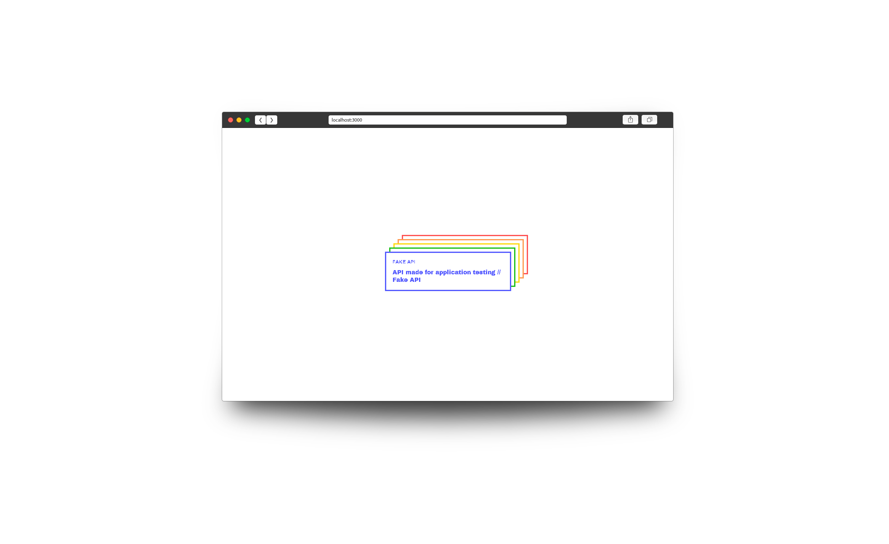

  

## 💻 Project

API made for application testing // Fake API

## 🚀 How to run

- Clone the repository
- Install the dependencies with `yarn`
- Start the server with `yarn start`

You can now access [`localhost:3000`](http://localhost:3000) of your browser.

## 📄 License

This project is under the MIT license. See the archive [LICENSE](LICENSE) for more details.

---

Made with 💙 by Felipe Almeida

